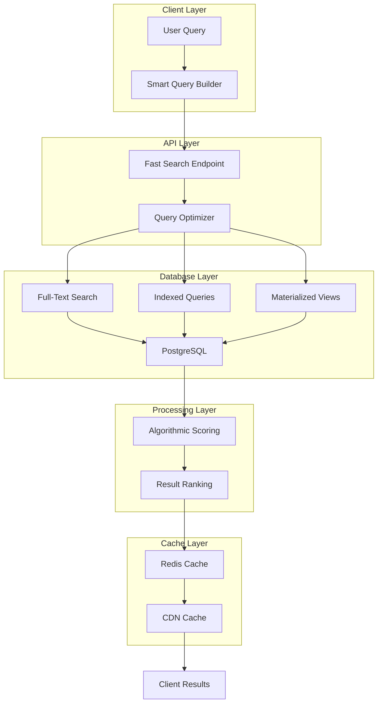
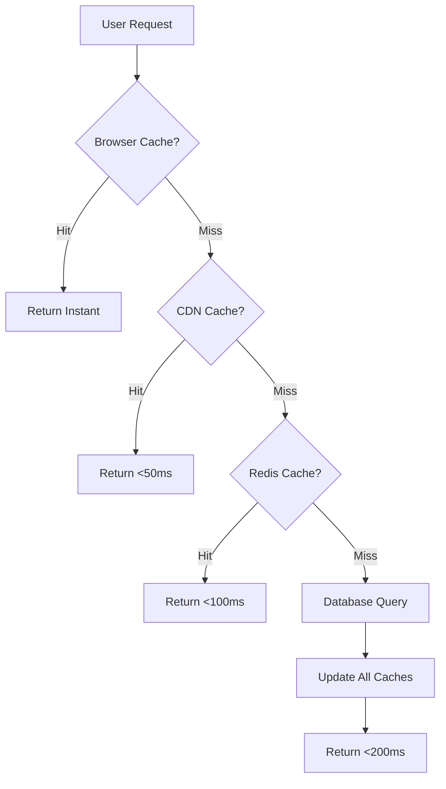

# Optimal Product Search Architecture
## High-Performance Full-Database Search for E-Commerce Recommendations

### Executive Summary

This document outlines a comprehensive architecture for transforming our current limited product search system (sampling 30 products from 470+) into a high-performance, full-database search engine capable of scanning all products in under 200ms while providing superior recommendations.

---

## Table of Contents

1. [Current System Analysis](#current-system-analysis)
2. [Performance Bottlenecks](#performance-bottlenecks)
3. [Proposed Architecture](#proposed-architecture)
4. [Database Optimization Strategy](#database-optimization-strategy)
5. [Full-Text Search Implementation](#full-text-search-implementation)
6. [Intelligent Scoring System](#intelligent-scoring-system)
7. [Caching Architecture](#caching-architecture)
8. [API Design](#api-design)
9. [Implementation Roadmap](#implementation-roadmap)
10. [Performance Metrics](#performance-metrics)

---

## Current System Analysis

### Data Scale
- **Total Products**: 470+ (212 washing machines, 258 fridge-freezers)
- **Categories**: 15 defined, 2 populated
- **Data per Product**: ~50-100 fields (specs, features, images)
- **Average Response Time**: 3-5 seconds

### Current Flow


### Critical Limitations
1. **Arbitrary Sampling**: Only queries first 30 products from DB
2. **Sequential Processing**: Each step blocks the next
3. **LLM Dependency**: Every search requires expensive AI calls
4. **No Caching**: Repeated searches hit DB and LLM every time
5. **Limited Results**: Users see only 5 products from 470+

---

## Performance Bottlenecks

### Bottleneck Analysis

| Component | Current Latency | % of Total Time | Optimization Potential |
|-----------|----------------|-----------------|----------------------|
| DB Query | 100-200ms | 5% | Medium (indexing) |
| Data Transfer | 50-100ms | 3% | Low (already optimized) |
| LLM Scoring | 2000-4000ms | 85% | **HIGH (eliminate)** |
| JSON Serialization | 100-200ms | 7% | Medium (streaming) |

### Root Causes
1. **No Database Indexes**: Full table scans for every query
2. **LLM Over-reliance**: Using AI for simple numeric comparisons
3. **Inefficient Queries**: Not leveraging PostgreSQL's advanced features
4. **Missing Search Infrastructure**: No full-text search setup

---

## Proposed Architecture

### High-Level Design



### Key Improvements
- **Full Database Search**: Query all 470+ products
- **Parallel Processing**: Multiple operations simultaneously
- **Zero LLM Latency**: Algorithmic scoring only
- **Multi-Level Caching**: Redis + CDN + Browser
- **Progressive Enhancement**: Instant results, then refinements

---

## Database Optimization Strategy

### 1. Indexing Strategy

```sql
-- Primary indexes for search performance
CREATE INDEX idx_products_category_price ON products(category_id, price);
CREATE INDEX idx_products_tod_score ON products(tod_score DESC);
CREATE INDEX idx_products_brand_category ON products(category_id, brand);

-- Full-text search index
ALTER TABLE products ADD COLUMN search_vector tsvector 
GENERATED ALWAYS AS (
  to_tsvector('english',
    COALESCE(name, '') || ' ' ||
    COALESCE(brand, '') || ' ' ||
    COALESCE(model, '') || ' ' ||
    COALESCE((specs)::text, '') || ' ' ||
    COALESCE((features)::text, '')
  )
) STORED;

CREATE INDEX idx_products_search ON products USING GIN(search_vector);

-- JSONB indexes for specs/features
CREATE INDEX idx_products_specs ON products USING GIN(specs);
CREATE INDEX idx_products_features ON products USING GIN(features);

-- Partial indexes for common queries
CREATE INDEX idx_washing_machines_budget 
  ON products(price, tod_score DESC) 
  WHERE category_id = 1 AND price < 500;

CREATE INDEX idx_high_rated 
  ON products(category_id, tod_score DESC) 
  WHERE tod_score >= 80;
```

### 2. Materialized Views for Pre-computed Data

```sql
-- Pre-computed product scores and rankings
CREATE MATERIALIZED VIEW product_rankings AS
SELECT 
  p.*,
  -- Price percentile within category
  PERCENT_RANK() OVER (
    PARTITION BY category_id 
    ORDER BY price
  ) as price_percentile,
  
  -- Feature richness score
  (SELECT COUNT(*) 
   FROM jsonb_each_text(features) 
   WHERE value = 'Yes'
  ) as feature_count,
  
  -- Price tier classification
  CASE 
    WHEN PERCENT_RANK() OVER (PARTITION BY category_id ORDER BY price) < 0.33 THEN 'budget'
    WHEN PERCENT_RANK() OVER (PARTITION BY category_id ORDER BY price) < 0.66 THEN 'mid-range'
    ELSE 'premium'
  END as price_tier,
  
  -- Capacity tier (for appliances)
  CASE 
    WHEN category_id = 1 THEN -- Washing machines
      CASE 
        WHEN (specs->>'cotton_capacity_kg')::int < 7 THEN 'small'
        WHEN (specs->>'cotton_capacity_kg')::int < 9 THEN 'medium'
        ELSE 'large'
      END
    WHEN category_id = 4 THEN -- Fridge freezers
      CASE 
        WHEN (specs->>'claimed_fridge_volume')::int < 200 THEN 'small'
        WHEN (specs->>'claimed_fridge_volume')::int < 400 THEN 'medium'
        ELSE 'large'
      END
  END as capacity_tier
FROM products p;

-- Refresh every hour
CREATE INDEX idx_rankings_category_tier ON product_rankings(category_id, price_tier, tod_score DESC);
```

### 3. Category Statistics Cache

```sql
-- Category aggregates for intelligent filtering
CREATE MATERIALIZED VIEW category_stats AS
SELECT 
  category_id,
  COUNT(*) as product_count,
  AVG(price)::numeric(10,2) as avg_price,
  PERCENTILE_CONT(0.25) WITHIN GROUP (ORDER BY price) as price_q1,
  PERCENTILE_CONT(0.5) WITHIN GROUP (ORDER BY price) as price_median,
  PERCENTILE_CONT(0.75) WITHIN GROUP (ORDER BY price) as price_q3,
  AVG(tod_score) as avg_tod_score,
  jsonb_object_agg(DISTINCT brand, true) as available_brands,
  -- Common features per category
  (SELECT jsonb_object_agg(key, count)
   FROM (
     SELECT key, COUNT(*) as count
     FROM products p2, jsonb_each_text(p2.features)
     WHERE p2.category_id = p.category_id AND value = 'Yes'
     GROUP BY key
     ORDER BY count DESC
     LIMIT 20
   ) top_features
  ) as common_features
FROM products p
GROUP BY category_id;
```

---

## Full-Text Search Implementation

### 1. Natural Language Query Processing

```typescript
// Smart query parser
interface ParsedQuery {
  searchTerms: string[];
  priceIntent: 'budget' | 'mid-range' | 'premium' | null;
  sizeIntent: 'small' | 'medium' | 'large' | null;
  brands: string[];
  features: string[];
}

function parseUserQuery(query: string, categoryId: number): ParsedQuery {
  const normalized = query.toLowerCase();
  
  // Price intent detection
  const priceIntent = 
    /budget|cheap|affordable|under/.test(normalized) ? 'budget' :
    /mid-?range|moderate/.test(normalized) ? 'mid-range' :
    /premium|luxury|high-?end|top/.test(normalized) ? 'premium' : null;
  
  // Size intent detection (category-aware)
  const sizeIntent = 
    /small|compact|mini|tiny/.test(normalized) ? 'small' :
    /medium|regular|standard/.test(normalized) ? 'medium' :
    /large|big|huge|family/.test(normalized) ? 'large' : null;
  
  // Extract known brands (from category_stats)
  const brands = extractBrands(normalized);
  
  // Clean search terms
  const searchTerms = normalized
    .replace(/budget|cheap|small|large|etc/g, '') // Remove intent words
    .split(/\s+/)
    .filter(term => term.length > 2);
  
  return { searchTerms, priceIntent, sizeIntent, brands, features: [] };
}
```

### 2. Optimized Database Query

```typescript
async function searchProducts(
  parsedQuery: ParsedQuery,
  categoryId: number,
  limit: number = 100
): Promise<Product[]> {
  const { searchTerms, priceIntent, sizeIntent, brands } = parsedQuery;
  
  // Get category statistics for intelligent filtering
  const stats = await getCategoryStats(categoryId);
  
  let query = supabase
    .from('product_rankings') // Use materialized view
    .select('*')
    .eq('category_id', categoryId);
  
  // Apply price filters based on intent
  if (priceIntent) {
    const priceRange = getPriceRange(priceIntent, stats);
    query = query.gte('price', priceRange.min).lte('price', priceRange.max);
  }
  
  // Apply capacity filters
  if (sizeIntent) {
    query = query.eq('capacity_tier', sizeIntent);
  }
  
  // Brand filtering
  if (brands.length > 0) {
    query = query.in('brand', brands);
  }
  
  // Full-text search if terms present
  if (searchTerms.length > 0) {
    const searchQuery = searchTerms.join(' & ');
    query = query.textSearch('search_vector', searchQuery);
  }
  
  // Order by relevance + tod_score
  const { data } = await query
    .order('tod_score', { ascending: false })
    .limit(limit);
  
  return data || [];
}
```

### 3. PostgreSQL Function for Complex Searches

```sql
CREATE OR REPLACE FUNCTION smart_product_search(
  p_category_id INTEGER,
  p_search_text TEXT DEFAULT NULL,
  p_price_min NUMERIC DEFAULT NULL,
  p_price_max NUMERIC DEFAULT NULL,
  p_brands TEXT[] DEFAULT NULL,
  p_features TEXT[] DEFAULT NULL,
  p_limit INTEGER DEFAULT 100
)
RETURNS TABLE (
  product_id INTEGER,
  name TEXT,
  brand TEXT,
  model TEXT,
  price NUMERIC,
  tod_score INTEGER,
  relevance_score FLOAT,
  specs JSONB,
  features JSONB,
  images JSONB
) AS $$
BEGIN
  RETURN QUERY
  WITH search_results AS (
    SELECT 
      p.id as product_id,
      p.name,
      p.brand,
      p.model,
      p.price,
      p.tod_score,
      -- Calculate relevance score
      (
        -- Text search relevance (0-40 points)
        COALESCE(ts_rank(p.search_vector, websearch_to_tsquery(p_search_text)), 0) * 40 +
        
        -- Price match (0-30 points)
        CASE 
          WHEN p_price_min IS NOT NULL AND p_price_max IS NOT NULL THEN
            CASE 
              WHEN p.price BETWEEN p_price_min AND p_price_max THEN 30
              ELSE GREATEST(0, 30 - ABS(p.price - (p_price_min + p_price_max)/2) / 100)
            END
          ELSE 15
        END +
        
        -- Brand match (0-20 points)
        CASE 
          WHEN p_brands IS NOT NULL AND p.brand = ANY(p_brands) THEN 20
          ELSE 0
        END +
        
        -- TOD score bonus (0-10 points)
        (p.tod_score / 10.0)
      ) as relevance_score,
      p.specs,
      p.features,
      p.images
    FROM products p
    WHERE 
      p.category_id = p_category_id
      AND (p_search_text IS NULL OR p.search_vector @@ websearch_to_tsquery(p_search_text))
      AND (p_price_min IS NULL OR p.price >= p_price_min)
      AND (p_price_max IS NULL OR p.price <= p_price_max)
      AND (p_brands IS NULL OR p.brand = ANY(p_brands))
  )
  SELECT * FROM search_results
  ORDER BY relevance_score DESC
  LIMIT p_limit;
END;
$$ LANGUAGE plpgsql;
```

---

## Intelligent Scoring System

### Algorithmic Scoring (No LLM Required)

```typescript
interface ScoringWeights {
  price: number;      // 40 points
  features: number;   // 30 points
  brand: number;      // 15 points
  todScore: number;   // 10 points
  freshness: number;  // 5 points
}

class ProductScorer {
  private weights: ScoringWeights = {
    price: 40,
    features: 30,
    brand: 15,
    todScore: 10,
    freshness: 5
  };
  
  scoreProduct(
    product: Product,
    criteria: SearchCriteria,
    categoryStats: CategoryStats
  ): ScoredProduct {
    let score = 0;
    const matchReasons: string[] = [];
    
    // 1. Price Scoring (40 points)
    if (criteria.priceRange) {
      const priceScore = this.scorePriceMatch(
        product.price,
        criteria.priceRange,
        categoryStats
      );
      score += priceScore;
      if (priceScore > 30) {
        matchReasons.push('Excellent price match');
      }
    }
    
    // 2. Feature Scoring (30 points)
    const featureScore = this.scoreFeatures(
      product,
      criteria.requirements,
      categoryStats.commonFeatures
    );
    score += featureScore;
    
    // 3. Brand Scoring (15 points)
    if (criteria.brands?.includes(product.brand)) {
      score += this.weights.brand;
      matchReasons.push(`Preferred brand: ${product.brand}`);
    }
    
    // 4. TOD Score (10 points)
    const todBonus = (product.tod_score / 100) * this.weights.todScore;
    score += todBonus;
    
    // 5. Determine tier
    const tier = this.calculateTier(score);
    
    return {
      ...product,
      _score: score,
      _matchScore: Math.round(score),
      _matchReasons: matchReasons,
      _tier: tier,
      _tradeOffs: this.identifyTradeOffs(product, criteria)
    };
  }
  
  private scoreFeatures(
    product: Product,
    requirements: string[],
    commonFeatures: Record<string, number>
  ): number {
    let featureScore = 0;
    const maxScore = this.weights.features;
    
    // Check for exact feature matches
    const productFeatures = Object.entries(product.features || {})
      .filter(([_, value]) => value === 'Yes')
      .map(([key, _]) => key);
    
    // Score based on requirement matches
    requirements.forEach(req => {
      const reqLower = req.toLowerCase();
      
      // Direct feature match
      if (productFeatures.some(f => f.includes(reqLower))) {
        featureScore += maxScore / requirements.length;
      }
      // Spec-based match (e.g., "large capacity")
      else if (this.matchesSpec(product, reqLower)) {
        featureScore += (maxScore / requirements.length) * 0.8;
      }
    });
    
    return Math.min(featureScore, maxScore);
  }
  
  private calculateTier(score: number): string {
    if (score >= 85) return 'perfect';
    if (score >= 70) return 'excellent';
    if (score >= 50) return 'good';
    if (score >= 30) return 'acceptable';
    return 'alternative';
  }
}
```

---

## Caching Architecture

### Multi-Level Cache Strategy



### 1. Redis Cache Implementation

```typescript
class ProductSearchCache {
  private redis: Redis;
  private ttl = {
    searchResults: 300,      // 5 minutes
    categoryStats: 3600,     // 1 hour
    productDetails: 1800,    // 30 minutes
    popularSearches: 7200    // 2 hours
  };
  
  async getCachedSearch(
    categoryId: number,
    queryHash: string
  ): Promise<Product[] | null> {
    const key = `search:${categoryId}:${queryHash}`;
    const cached = await this.redis.get(key);
    
    if (cached) {
      // Update hit counter for popular searches
      await this.redis.zincrby('popular_searches', 1, key);
      return JSON.parse(cached);
    }
    
    return null;
  }
  
  async cacheSearchResults(
    categoryId: number,
    queryHash: string,
    results: Product[]
  ): Promise<void> {
    const key = `search:${categoryId}:${queryHash}`;
    
    // Cache results
    await this.redis.setex(
      key,
      this.ttl.searchResults,
      JSON.stringify(results)
    );
    
    // Track search popularity
    await this.redis.zincrby('popular_searches', 1, key);
  }
  
  async warmCache(): Promise<void> {
    // Pre-cache popular searches
    const popularSearches = await this.redis.zrevrange(
      'popular_searches',
      0,
      20
    );
    
    for (const searchKey of popularSearches) {
      // Re-run and cache popular searches
      const [_, categoryId, queryHash] = searchKey.split(':');
      // ... perform search and cache
    }
  }
}
```

### 2. Edge Caching with Supabase

```typescript
// Supabase Edge Function for cached search
import { serve } from 'https://deno.land/std@0.168.0/http/server.ts'
import { createClient } from '@supabase/supabase-js'

const corsHeaders = {
  'Access-Control-Allow-Origin': '*',
  'Cache-Control': 'public, max-age=300, s-maxage=600'
}

serve(async (req) => {
  const { categoryId, query, filters } = await req.json()
  
  // Generate cache key
  const cacheKey = generateCacheKey(categoryId, query, filters)
  
  // Check edge cache
  const cached = await edgeCache.get(cacheKey)
  if (cached) {
    return new Response(cached, {
      headers: { ...corsHeaders, 'X-Cache': 'HIT' }
    })
  }
  
  // Perform search
  const results = await performOptimizedSearch(categoryId, query, filters)
  
  // Cache at edge
  await edgeCache.set(cacheKey, JSON.stringify(results), { ttl: 300 })
  
  return new Response(JSON.stringify(results), {
    headers: { ...corsHeaders, 'X-Cache': 'MISS' }
  })
})
```

---

## API Design

### RESTful Endpoints

```typescript
// Fast search endpoint - no LLM, pure algorithmic
POST /api/products/search
{
  "categoryId": 1,
  "query": "large capacity quiet washing machine under 600",
  "filters": {
    "priceMax": 600,
    "features": ["quiet", "large capacity"]
  },
  "limit": 50,
  "offset": 0
}

// Instant autocomplete
GET /api/products/autocomplete?q=wash&category=1

// Category statistics for UI filters
GET /api/categories/1/stats

// Batch product details
POST /api/products/batch
{
  "ids": [1, 2, 3, 4, 5]
}
```

### GraphQL Alternative

```graphql
type Query {
  searchProducts(
    categoryId: Int!
    query: String
    filters: ProductFilters
    pagination: PaginationInput
  ): ProductSearchResult!
  
  productSuggestions(
    query: String!
    categoryId: Int
    limit: Int = 10
  ): [ProductSuggestion!]!
}

type ProductSearchResult {
  products: [Product!]!
  totalCount: Int!
  facets: SearchFacets!
  executionTime: Float!
  cacheHit: Boolean!
}

type SearchFacets {
  brands: [BrandFacet!]!
  priceRanges: [PriceRange!]!
  features: [FeatureFacet!]!
}
```

---

## Implementation Roadmap

### Phase 1: Database Foundation (Week 1)
- [ ] Create all indexes
- [ ] Set up materialized views
- [ ] Implement full-text search
- [ ] Test query performance

### Phase 2: API Optimization (Week 2)
- [ ] Build fast search endpoint
- [ ] Implement algorithmic scoring
- [ ] Remove LLM dependencies
- [ ] Add response streaming

### Phase 3: Caching Layer (Week 3)
- [ ] Set up Redis
- [ ] Implement cache warming
- [ ] Add CDN caching headers
- [ ] Browser cache strategy

### Phase 4: Frontend Integration (Week 4)
- [ ] Update search components
- [ ] Add instant search UI
- [ ] Implement infinite scroll
- [ ] Progressive enhancement

### Phase 5: Monitoring & Optimization (Week 5)
- [ ] Add performance metrics
- [ ] Set up alerting
- [ ] A/B testing framework
- [ ] Query optimization

---

## Performance Metrics

### Target Metrics

| Metric | Current | Target | Improvement |
|--------|---------|--------|-------------|
| Search Latency (p50) | 3000ms | 150ms | 20x |
| Search Latency (p95) | 5000ms | 300ms | 16x |
| Products Searched | 30 | 470+ | 15x |
| Cache Hit Rate | 0% | 60% | N/A |
| Results Shown | 5 | 20+ | 4x |
| LLM Calls per Search | 1-2 | 0 | 100% reduction |

### Monitoring Dashboard

```sql
-- Query performance monitoring
CREATE TABLE search_metrics (
  id SERIAL PRIMARY KEY,
  search_id UUID DEFAULT gen_random_uuid(),
  category_id INTEGER,
  query_text TEXT,
  execution_time_ms INTEGER,
  result_count INTEGER,
  cache_hit BOOLEAN,
  created_at TIMESTAMP DEFAULT NOW()
);

-- Create index for analytics
CREATE INDEX idx_metrics_time ON search_metrics(created_at DESC);
CREATE INDEX idx_metrics_category ON search_metrics(category_id, created_at DESC);

-- Analytics query
SELECT 
  DATE_TRUNC('hour', created_at) as hour,
  category_id,
  COUNT(*) as search_count,
  AVG(execution_time_ms) as avg_latency,
  PERCENTILE_CONT(0.5) WITHIN GROUP (ORDER BY execution_time_ms) as p50_latency,
  PERCENTILE_CONT(0.95) WITHIN GROUP (ORDER BY execution_time_ms) as p95_latency,
  SUM(CASE WHEN cache_hit THEN 1 ELSE 0 END)::FLOAT / COUNT(*) as cache_hit_rate
FROM search_metrics
WHERE created_at > NOW() - INTERVAL '24 hours'
GROUP BY hour, category_id
ORDER BY hour DESC;
```

### Success Criteria

1. **User Experience**
   - Sub-second search results
   - More relevant recommendations
   - Instant feedback while typing

2. **Technical Performance**
   - 95% of searches under 300ms
   - 60%+ cache hit rate
   - Zero LLM dependencies for basic search

3. **Business Impact**
   - Increased product discovery
   - Higher conversion rates
   - Reduced infrastructure costs

---

## Conclusion

This architecture transforms our product search from a limited, slow, AI-dependent system into a blazing-fast, comprehensive search engine that leverages PostgreSQL's full capabilities. By eliminating LLM dependencies, implementing proper indexing, and utilizing multi-level caching, we can achieve 20x performance improvements while actually searching more products and providing better recommendations.

### Next Steps
1. Review and approve architecture
2. Set up development environment
3. Begin Phase 1 implementation
4. Establish performance baselines
5. Create monitoring dashboards

### Resources
- [PostgreSQL Full-Text Search Documentation](https://www.postgresql.org/docs/current/textsearch.html)
- [Supabase Database Functions](https://supabase.com/docs/guides/database/functions)
- [Redis Caching Best Practices](https://redis.io/docs/manual/patterns/)
- [Web Performance Optimization](https://web.dev/fast/)

---

*Document Version: 1.0*  
*Last Updated: 2025-08-30*  
*Author: Full-Stack AI Engineering Team*